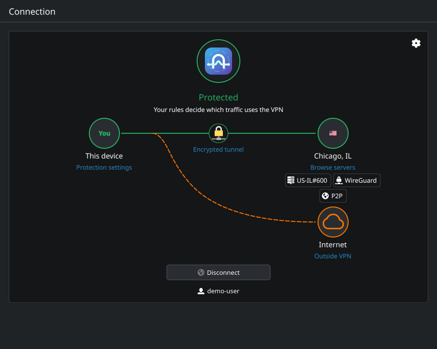
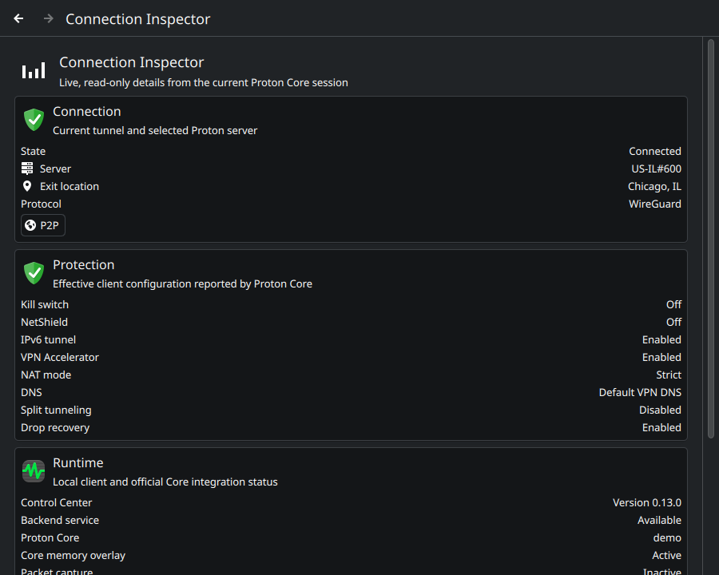

<p align="center">
  
</p>

<h1 align="center">Plasma VPN</h1>

<p align="center">
  <strong>A native KDE Plasma client for Proton VPN, built around Proton's official Linux VPN Core.</strong>
</p>

<p align="center">
  <a href="https://github.com/uglyegg/proton-vpn-kde/actions/workflows/ci.yml"></a>
  <a href="https://github.com/uglyegg/proton-vpn-kde/actions/workflows/rpm.yml"></a>
  <a href="https://github.com/uglyegg/proton-vpn-kde/actions/workflows/deb.yml"></a>
  <a href="LICENSE"></a>
  <a href="docs/COMPATIBILITY.md"></a>
  <a href="docs/COMPATIBILITY.md"></a>
  <a href="docs/VISUAL-SYSTEM.md"></a>
  
</p>

> [!IMPORTANT]
> Plasma VPN is independent community software. It is not developed, reviewed, sponsored, or endorsed by Proton AG. “Proton” and “Proton VPN” identify compatibility with Proton's service; Proton's names and marks remain its own.

Plasma VPN gives Proton's Linux networking stack a first-class KDE home: a Kirigami Control Center, a lean resident Plasma agent, native notifications, KRunner actions, global shortcuts, System Settings integration, and a Plasma status notifier. The visible client is implemented entirely with C++20, Qt 6, KDE Frameworks 6, and Kirigami; it has no direct GTK or GNOME desktop dependency.

Proton's Fedora and Ubuntu API Core packages currently retain a dependency on the GNOME NetworkManager OpenVPN editor, which installs GTK libraries. Plasma VPN does not use that editor component or add another GTK dependency, but it also does not remove or conceal an upstream Core packaging requirement.

It is not a new VPN implementation. Proton's installed Core continues to own protocols, NetworkManager integration, server scoring, kill switch, IPv6 leak protection, split tunneling, account sessions, and persisted VPN state.

## See it

| Connected | Split tunneling |
| :---: | :---: |
| [](docs/images/overview.png) | [](docs/images/overview-split.png) |

| Server browser | Connection Inspector | Native settings |
| :---: | :---: | :---: |
| [](docs/images/locations.png) | [](docs/images/inspector.png) | [](docs/images/settings.png) |

These previews show the 0.13 release-line interface in light and dark Plasma themes. They use the deterministic demo backend: the connection is simulated, with no Proton account, NetworkManager changes, or real VPN tunnel.

## Why this exists

Proton's official Linux networking stack is reusable, but its shipping desktop experience is GTK/GNOME-oriented. Plasma VPN asks a narrow question: what would the same service feel like if KDE Plasma were the target desktop rather than a compatibility environment?

The project was started by a paying Proton subscriber since 2017 who wanted the Linux and KDE experience to reflect the quality of the underlying service. The goal is constructive: build a credible Plasma client, preserve Proton's security ownership, and make both the community code and any upstream patches inexpensive to review.

## What it offers

- Native password and TOTP/recovery-code sign-in, plus Proton FIDO2 when the
  installed Core explicitly provides cancellable multi-key selection.
- Country, city/state, Secure Core, and exact-server browsing with combinable P2P, Streaming, Tor, and Secure Core filters.
- Proton-ranked fastest connections, saved capability defaults, global search, and pinned tray targets.
- Protocol, NetShield, NAT, port forwarding, IPv6, custom DNS, kill-switch, and split-tunneling controls through Core's public settings APIs.
- A resident native agent for tray actions, notifications, shortcuts, auto-connect, and reconnect coordination while the full Control Center stays on demand. Shared Startup controls let you opt into login launch, choose an open window or tray-only startup, and connect automatically to your saved target.
- An on-demand, read-only Connection Inspector for the active server, capabilities, protection configuration, and local integration status, with no traffic collection or retained history.
- In the unreleased 0.14.1 preview, connection-time exit-address labels, a read-only local setup check for Core/backend status and Secret Service availability, and a community diagnostics preview that copies only allowlisted local facts when requested.
- KRunner connection requests that require explicit Control Center confirmation rather than trusting the shared KRunner process as a VPN controller.
- Direct Proton support-report submission, crash reporting, and optional Core
  connection telemetry are disabled in community builds. Settings and copied
  community diagnostics show that policy explicitly. Telemetry-capable builds
  expose an off-by-default user preference. Required account, server, and VPN
  service traffic remains unchanged.

The maintained comparison with Proton's GTK client is in [Feature parity](docs/PARITY.md).

## Trust boundary

```text
Plasma agent (resident)  ─┐
                          ├─ owner-pinned, policy-checked session D-Bus
Control Center (on demand)┘
                                  │
                    Community adapter (Python)
                                  │ official public API
                    Proton VPN API Core (official)
                                  │
        NetworkManager · protocols · kill switch · split tunneling
```

Community code owns the Plasma experience, bounded input validation, and lifecycle coordination. Official Proton packages own VPN networking and session persistence. Authentication fields cross the community process boundary only as bounded, one-use encrypted ciphertext in sealed Linux memory descriptors.

The desktop boundary resists ordinary and sandboxed session-bus peers; it does not claim OS-backed process identity against arbitrary native code already running as the same desktop user. The precise boundary and stronger-but-incompatible alternatives are documented in [Backend service hardening](docs/HARDENING.md).

For the complete design, see [Architecture](docs/ARCHITECTURE.md), [Authentication](docs/AUTHENTICATION.md), and [Backend service hardening](docs/HARDENING.md).

## Engineering posture

The client has regression tests for asynchronous recovery and desktop integration, isolated demo captures for layout checks, and static-analysis and sanitizer gates. Each pull request gets one source and package-validation run; release tags add repeated binary/source reproducibility checks and retained artifacts without duplicating feature-branch jobs.

The 0.13.0 runtime release passed a frozen seven-perspective review. Its six bounded findings are corrected and covered by regressions; no P0 or P1 issue was substantiated. The 0.13.1 release adds cross-distribution packaging without changing VPN mechanics. CI validates source, minimum Python dependencies, Clang-Tidy, sanitizers, Fedora and Ubuntu packages, overlay policy, reproducibility inputs, and provenance without duplicating feature-branch jobs. Installed Fedora acceptance covers authentication, server browsing, settings, connection lifecycle, tray behavior, KDE launch, and inactive-protection recovery. The unreleased 0.14.1 preview has focused checks but has not completed release review, installed acceptance, or the feature-release soak.

The concise [security and engineering assessment](docs/SECURITY-AUDIT-2026-08-30.md) records findings, controls, evidence, and residual risk. Memory, CPU, search, and retention measurements are in [Performance](docs/PERFORMANCE.md).

These are engineering checks, not certification. The project has received maintainer-directed, AI-assisted review; it has not received an independent third-party security audit or penetration test.

## Current status

Version 0.13.1 is the current public release; 0.14.1 is an unreleased preview branch, not a public package or support claim. Version 0.12.0 was an accepted internal milestone and was never tagged or published. Fedora 44 remains the live-accepted target for the published version. Ubuntu 26.04 amd64 with Plasma 6 is the second package-validated target: CI builds and tests the client plus both required overlays as binary and source Debian packages. It will remain explicitly package-validated rather than live-supported until community field reports establish the Plasma lifecycle. Exact Core and dependency baselines are maintained in [Compatibility](docs/COMPATIBILITY.md).

> [!NOTE]
> Verified KeePassXC support uses the separately packaged, provider-neutral Proton keyring rebuild recorded in [Compatibility](docs/COMPATIBILITY.md). The source, patches, tests, and manifests are included under [`packaging/fedora/keyring-overlay`](packaging/fedora/keyring-overlay/) with Debian packaging under [`packaging/debian/keyring-overlay`](packaging/debian/keyring-overlay/). Release CI builds the overlay beside the client; both package formats require explicit capabilities instead of silently replacing an installed Python file.
>
> Reliable Protun reconnects on Plasma also use the independently reviewable API-Core overlays under [`packaging/fedora/api-core-overlay`](packaging/fedora/api-core-overlay/) and [`packaging/debian/api-core-overlay`](packaging/debian/api-core-overlay/). Each reconstructs Proton's exact signed distribution payload, verifies every changed path and hash, and keeps the transient tunnel key in Core's existing unsaved NetworkManager profile instead of relying on a missing Plasma Protun secret plugin.

## Evaluate or contribute

The safe demo backend exercises the interface without a Proton account or NetworkManager access:

```bash
cmake -S . -B build -G Ninja -DBUILD_TESTING=ON
cmake --build build

PYTHONPATH=backend python3 -m proton_vpn_kde_backend --demo
./build/proton-vpn-kde
```

Run `ctest --test-dir build --output-on-failure`, `scripts/check-static-analysis.sh`, and `scripts/check-python-analysis.sh` for the standard source verification. The Clang analysis commands and required tools are documented in [Contributing](CONTRIBUTING.md). Fedora dependencies and RPM instructions are in the [packaging guide](packaging/fedora/README.md); Ubuntu build and release commands are in the [release procedure](docs/RELEASING.md).

Before contributing, read [Contributing](CONTRIBUTING.md). Security issues must follow the private process in [Security policy](SECURITY.md); account, billing, service, and unmodified official-package problems belong with [Proton Support](https://proton.me/support/contact).

## Project references

| Question | Reference |
| --- | --- |
| Will it work on my system? | [Compatibility](docs/COMPATIBILITY.md) |
| What is implemented or intentionally different? | [Feature parity](docs/PARITY.md) |
| What is planned next? | [Roadmap](docs/ROADMAP.md) |
| How are releases produced? | [Release procedure](docs/RELEASING.md) |
| What changed? | [Changelog](CHANGELOG.md) |

Community code is licensed under `GPL-3.0-or-later`; see [LICENSE](LICENSE), [COPYING.md](COPYING.md), and [Third-party notices](THIRD_PARTY_NOTICES.md). This repository intentionally uses original neutral artwork rather than Proton's logo. The GPL license for Proton's source code does not grant trademark rights or imply endorsement.
