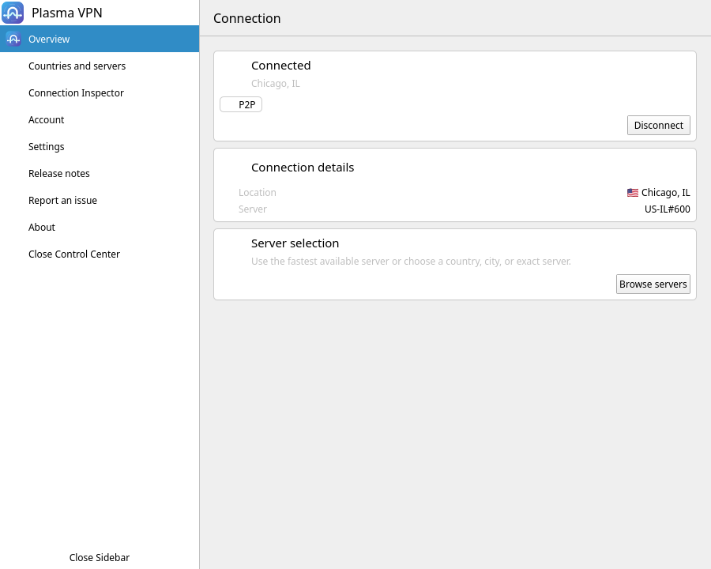
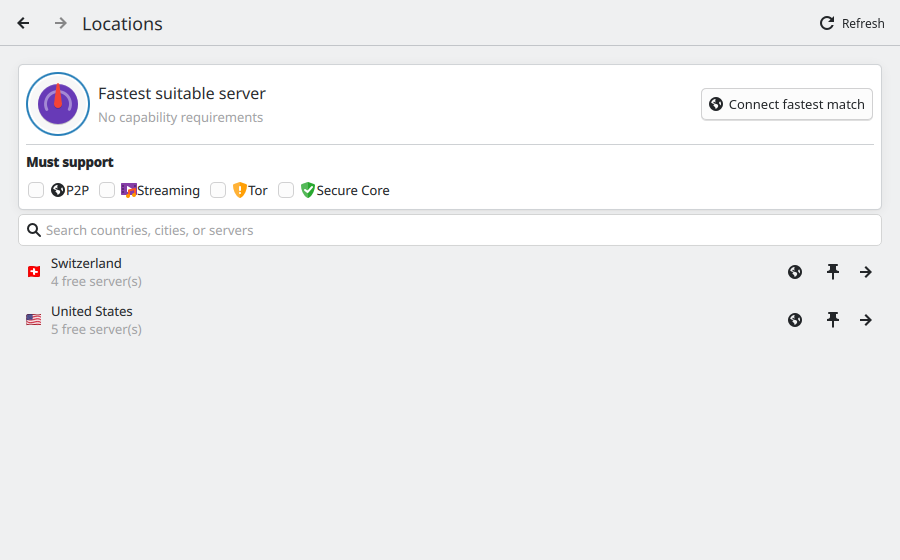
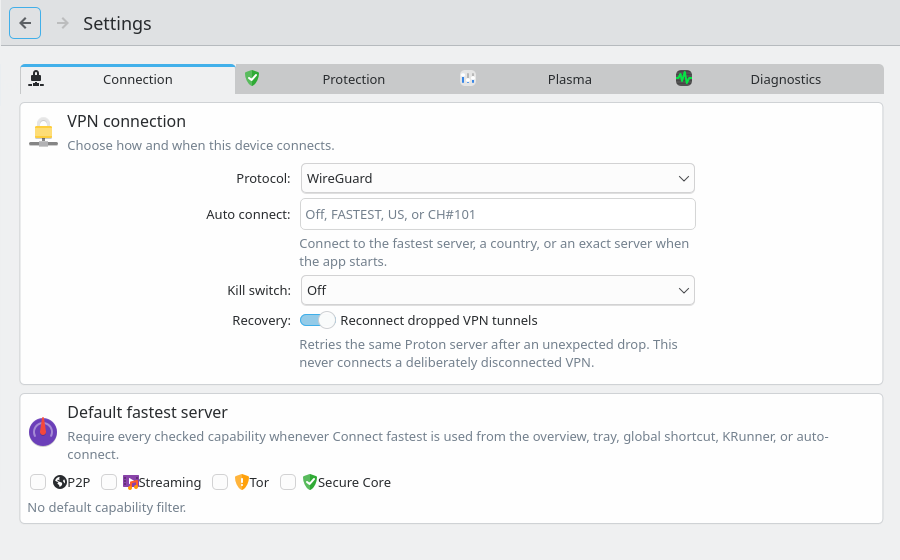

<p align="center">
  
</p>

<h1 align="center">Plasma VPN</h1>

<p align="center">
  <strong>A native KDE Plasma client for Proton VPN, built around Proton's official Linux VPN Core.</strong>
</p>

<p align="center">
  <a href="https://github.com/uglyegg/proton-vpn-kde/actions/workflows/ci.yml"></a>
  <a href="https://github.com/uglyegg/proton-vpn-kde/actions/workflows/rpm.yml"></a>
  <a href="LICENSE"></a>
  <a href="docs/COMPATIBILITY.md"></a>
  <a href="docs/VISUAL-SYSTEM.md"></a>
  
</p>

> [!IMPORTANT]
> Plasma VPN is independent community software. It is not developed, reviewed, sponsored, or endorsed by Proton AG. “Proton” and “Proton VPN” identify compatibility with Proton's service; Proton's names and marks remain its own.

Plasma VPN gives Proton's Linux networking stack a first-class KDE home: a Kirigami Control Center, a lean resident Plasma agent, native notifications, KRunner actions, global shortcuts, System Settings integration, and a Plasma status notifier. The visible client is implemented entirely with C++20, Qt 6, KDE Frameworks 6, and Kirigami; it has no direct GTK or GNOME desktop dependency.

Proton's Fedora API Core package currently retains a transitive dependency on `NetworkManager-openvpn-gnome`, which installs GTK libraries. Plasma VPN does not use that editor component or add another GTK dependency, but it also does not remove or conceal an upstream Core packaging requirement.

It is not a new VPN implementation. Proton's installed Core continues to own protocols, NetworkManager integration, server scoring, kill switch, IPv6 leak protection, split tunneling, account sessions, and persisted VPN state.

## See it

| Connected overview | Server browser | Native settings |
| :---: | :---: | :---: |
| [](docs/images/overview.png) | [](docs/images/locations.png) | [](docs/images/settings.png) |

The screenshots use the deterministic demo backend. The connection is simulated; no Proton account, NetworkManager state, or real VPN tunnel was used.

## Why this exists

Proton's official Linux networking stack is reusable, but its shipping desktop experience is GTK/GNOME-oriented. Plasma VPN asks a narrow question: what would the same service feel like if KDE Plasma were the target desktop rather than a compatibility environment?

The project was started by a paying Proton subscriber since 2017 who wanted the Linux and KDE experience to reflect the quality of the underlying service. The goal is constructive: build a credible Plasma client, preserve Proton's security ownership, and make both the community code and any upstream patches inexpensive to review.

## What it offers

- Native password, TOTP/recovery-code, and Proton FIDO2 sign-in flows.
- Country, city/state, Secure Core, and exact-server browsing with combinable P2P, Streaming, Tor, and Secure Core filters.
- Proton-ranked fastest connections, saved capability defaults, global search, and pinned tray targets.
- Protocol, NetShield, NAT, port forwarding, IPv6, custom DNS, kill-switch, and split-tunneling controls through Core's public settings APIs.
- A resident native agent for tray actions, notifications, shortcuts, auto-connect, and reconnect coordination while the full Control Center stays on demand.
- KRunner connection requests that require explicit Control Center confirmation rather than trusting the shared KRunner process as a VPN controller.
- Direct Proton support-report and crash-report submission disabled in community builds so unofficial-client defects are not sent to Proton as official-client reports.

The maintained comparison with Proton's GTK client is in [Feature parity](docs/PARITY.md).

## Trust boundary

```text
Plasma agent (resident)  ─┐
                          ├─ authenticated session D-Bus
Control Center (on demand)┘
                                  │
                    Community adapter (Python)
                                  │ official public API
                    Proton VPN API Core (official)
                                  │
        NetworkManager · protocols · kill switch · split tunneling
```

Community code owns the Plasma experience, bounded input validation, and lifecycle coordination. Official Proton packages own VPN networking and session persistence. Authentication fields cross the community process boundary only as bounded, one-use encrypted ciphertext in sealed Linux memory descriptors.

For the complete design, see [Architecture](docs/ARCHITECTURE.md), [Authentication](docs/AUTHENTICATION.md), and [Backend service hardening](docs/HARDENING.md).

## Engineering posture

| Evidence | Current 0.11.2 release evidence |
| --- | --- |
| Automated verification | 36/36 CTest tests, including 130 backend tests, plus Python 3.11/minimum-dependency and Core 5.5.6 contract gates, Mypy, Clang-Tidy, ASan/LSan/UBSan, and a measured 75% backend branch-coverage floor |
| Integration verification | QML diagnostics, D-Bus activation, staged installation, KRunner, and System Settings |
| Package verification | Fedora source and binary RPM build, artifact policy checks, and an isolated transaction test |
| Security assessment | All seven findings closed; no finding from the assessment remains open |
| Disconnected demo footprint | 81.2 MiB combined PSS across backend, agent, and Control Center; the resident agent measured 5.5 MiB PSS |
| Server search | 0.207–5.283 ms measured median across representative queries against an 18,138-server cache |

These are scoped engineering measurements, not certification. The project has completed a maintainer-directed, AI-assisted security assessment, but it has not received an independent security audit or penetration test. Read the [security assessment](docs/SECURITY-AUDIT-2026-08-30.md) and [performance methodology](docs/PERFORMANCE.md) for the evidence and limits.

## Current status

The first public alpha targets Fedora 44, KDE Plasma 6, Qt 6.8 or newer, and Proton VPN API Core 5.5.6 or newer. Other distributions may work but have not completed the packaged acceptance battery.

> [!NOTE]
> Verified KeePassXC support uses the separately packaged, provider-neutral Proton keyring rebuild recorded in [Compatibility](docs/COMPATIBILITY.md). The source, patches, tests, manifest, and Fedora spec are included under [`packaging/fedora/keyring-overlay`](packaging/fedora/keyring-overlay/); release CI builds its binary and source RPMs beside the client. The client RPM requires that explicit capability instead of silently replacing an installed Python file.
>
> Reliable Protun reconnects on Plasma also use the independently reviewable API-Core overlay under [`packaging/fedora/api-core-overlay`](packaging/fedora/api-core-overlay/). It reconstructs Proton's exact signed Fedora payload, verifies every changed path and hash, and keeps the transient tunnel key in Core's existing unsaved NetworkManager profile instead of relying on a missing Plasma Protun secret plugin. Release CI ships that overlay's binary and source RPMs as part of the required artifact set.

## Evaluate or contribute

The safe demo backend exercises the interface without a Proton account or NetworkManager access:

```bash
cmake -S . -B build -G Ninja -DBUILD_TESTING=ON
cmake --build build

PYTHONPATH=backend python3 -m proton_vpn_kde_backend --demo
./build/proton-vpn-kde
```

Run `ctest --test-dir build --output-on-failure`, `scripts/check-static-analysis.sh`, and `scripts/check-python-analysis.sh` for the standard source verification. The Clang analysis commands and required tools are documented in [Contributing](CONTRIBUTING.md). Fedora dependencies and RPM instructions are in the [packaging guide](packaging/fedora/README.md).

Before contributing, read [Contributing](CONTRIBUTING.md). Security issues must follow the private process in [Security policy](SECURITY.md); account, billing, service, and unmodified official-package problems belong with [Proton Support](https://proton.me/support/contact).

## Project references

| Question | Reference |
| --- | --- |
| Will it work on my system? | [Compatibility](docs/COMPATIBILITY.md) |
| What is implemented or intentionally different? | [Feature parity](docs/PARITY.md) |
| What is planned next? | [Roadmap](docs/ROADMAP.md) |
| How are releases produced? | [Release procedure](docs/RELEASING.md) |
| What changed? | [Changelog](CHANGELOG.md) |

Community code is licensed under `GPL-3.0-or-later`; see [LICENSE](LICENSE), [COPYING.md](COPYING.md), and [Third-party notices](THIRD_PARTY_NOTICES.md). This repository intentionally uses original neutral artwork rather than Proton's logo. The GPL license for Proton's source code does not grant trademark rights or imply endorsement.
